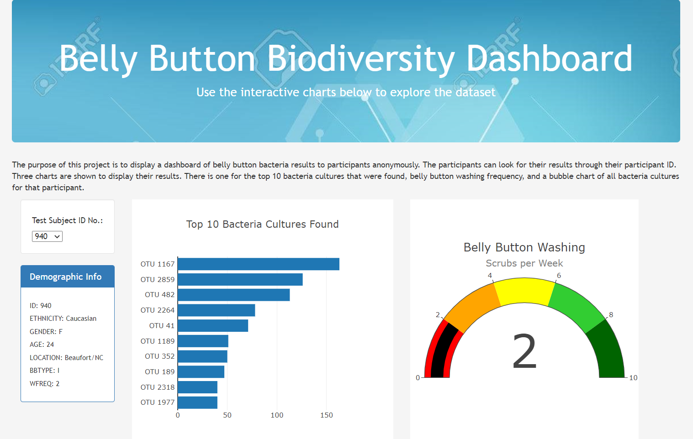

# Belly Button Biodiversity

Rosa is a researcher in a microbiology lab. She is interested in synthesizing bacteria to taste like beef. The study she conducts researches bacteria that lives in a human’s belly button.

The purpose of this project is to display a dashboard of belly button bacteria results to participants anonymously. The participants can look for their results through their participant ID. Three charts are shown to display their results. There is one for the top 10 bacteria cultures that were found, belly button washing frequency, and a bubble chart of all bacteria cultures for that participant. 
Please see below for a screenshot of the project. This dashboard can be access here: [https://nguyencao247.github.io/Belly-Button-Biodiversity/](https://nguyencao247.github.io/Belly-Button-Biodiversity/)

